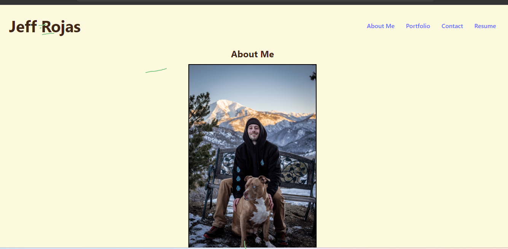
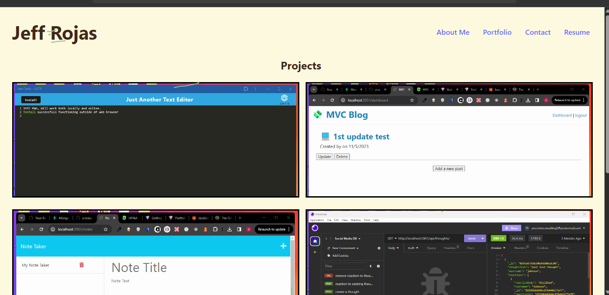
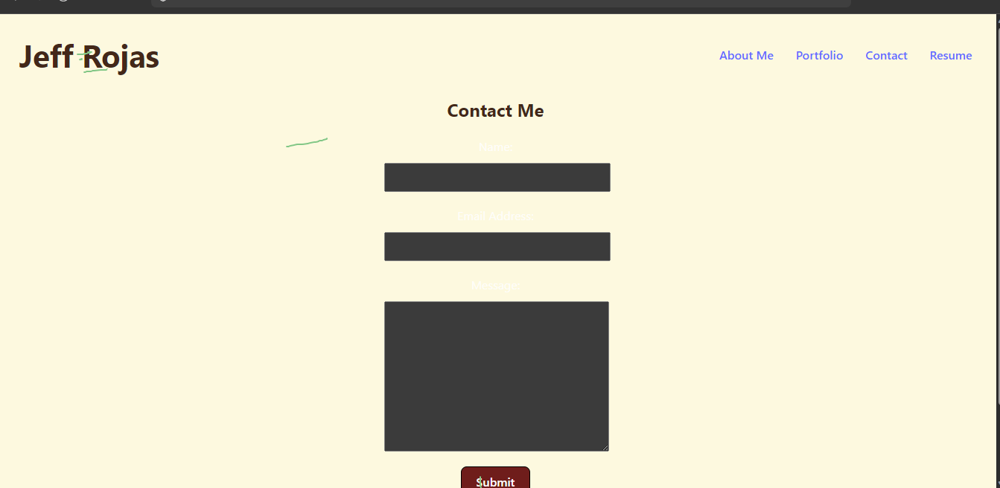
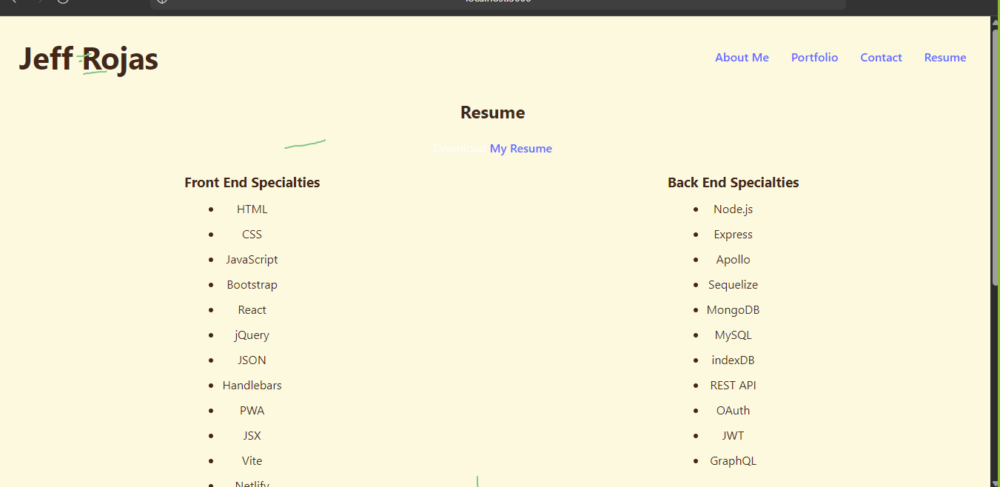

# 20 React: React Portfolio

## Description

```md
Being a web developer means being part of a community. You’ll need a place not only to share your projects while you're applying for jobs or working as a freelancer but also to share your work with other developers and collaborate on projects.

Your task is to create a portfolio using your new React skills, which will help set you apart from other developers whose portfolios don’t use the latest technologies.

You’ll deploy this application to Netlify. Follow the instructions in the Git Guide or consult the [Docs on Netlify](https://vitejs.dev/guide/static-deploy.html#netlify) to create a build that you can deploy.
```

## User Story

```md
AS AN employer looking for candidates with experience building single-page applications
I WANT to view a potential employee's deployed React portfolio of work samples
SO THAT I can assess whether they're a good candidate for an open position
```

## Acceptance Criteria

```md
GIVEN a single-page application portfolio for a web developer
WHEN I load the portfolio
THEN I am presented with a page containing a header, a section for content, and a footer
WHEN I view the header
THEN I am presented with the developer's name and navigation with titles corresponding to different sections of the portfolio
WHEN I view the navigation titles
THEN I am presented with the titles About Me, Portfolio, Contact, and Resume, and the title corresponding to the current section is highlighted
WHEN I click on a navigation title
THEN the browser URL changes and I am presented with the corresponding section below the navigation and that title is highlighted
WHEN I load the portfolio the first time
THEN the About Me title and section are selected by default
WHEN I am presented with the About Me section
THEN I see a recent photo or avatar of the developer and a short bio about them
WHEN I am presented with the Portfolio section
THEN I see titled images of six of the developer’s applications with links to both the deployed applications and the corresponding GitHub repositories
WHEN I am presented with the Contact section
THEN I see a contact form with fields for a name, an email address, and a message
WHEN I move my cursor out of one of the form fields without entering text
THEN I receive a notification that this field is required
WHEN I enter text into the email address field
THEN I receive a notification if I have entered an invalid email address
WHEN I am presented with the Resume section
THEN I see a link to a downloadable resume and a list of the developer’s proficiencies
WHEN I view the footer
THEN I am presented with text or icon links to the developer’s GitHub and LinkedIn profiles, and their profile on a third platform (Stack Overflow, Twitter)
```

## Mock-Up

The following screenshot shows the web application's appearance and functionality:



## Motivation

I was motivated to complete this project because I wanted to learn how to use React to create a portfolio. I also wanted to learn how to use React to create a single page application.

## Why

I created this project while learning react, react is an efficient, flexible JavaScript library for building user interfaces. It lets you compose complex UIs from small and isolated pieces of code called “components”.

## What problem does it solve?

This project solves the problem of creating a a lightweight and efficient single page application. It allows for faster rendering without the requirement of a page refresh.

## What did you learn?

I learned react is quick not requiring page refresh when navigating through the site. When writing the code I learned how to use react components, react hooks, react router, useState vs useRef, reRenders, and react router dom. This project also helped me learn how to use react to create a portfolio.

## What makes your project stand out

My project stands out because it uses React to create a portfolio as a single page application. It uses netlify for deployment allowing for users to view the site without the need to refresh the page.

## Installation

To install this project you will need to clone the repository onto your local machine. Once the repository is cloned, you will need to install the dependencies by running the command "npm install" in your terminal. Once the dependencies are installed you will need to run the command "npm start" in your terminal to start the application.

## Usage

This project will be used to demonstrate my skills as a web developer. It will be used to showcase my projects and provide a way for potential employers to contact me.

Page Load


Nav Link Projects


Nav Link Contact


Nav Link Resume


### Link to github repo

<https://github.com/precisecoding/portfolio-new-project>

### Deployed link

<https://jeff-rojas.netlify.app/>

### This site was built using netlify

<https://netlify.com>
<https://react.com>

### License

MIT License:
<https://opensource.org/licenses/MIT>
<https://choosealicense.com/licenses/mit/>
LICENSE file included in repository.

### Thanks to everyone for support and contributions

Sources used: <https://developer.mozilla.org/en-US/>, <https://www.w3schools.com/>, <https://stackoverflow.com/>. Worked with TA George Yoo while on writing the pseudo code, once again he was very helpful.
